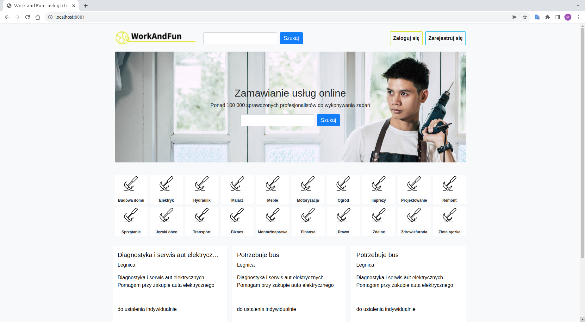
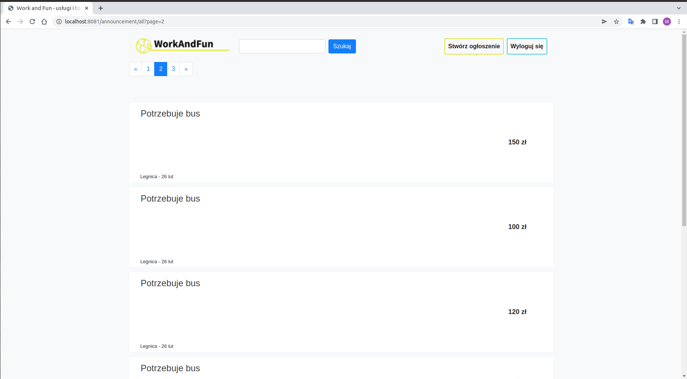
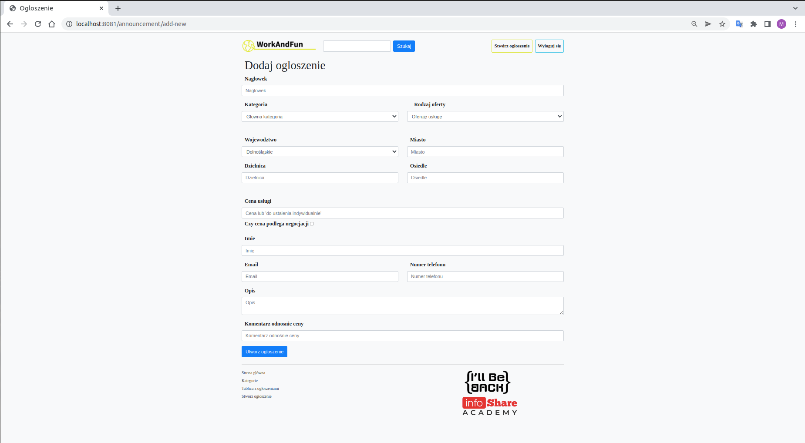

# WORK AND FUN
<br>
Our portal is searching and offering services of any type and scope, the users of which will be private persons.

Examples of services:
* Are you a DIY enthusiast, you like to drill, do you have a free evening and want to earn some extra money? You can publish your services / skills or respond to someone's request. For example, another person needs a helper to assemble IKEA furniture.
* Do you like and can bake cakes? - Maybe there will be a person who needs a good gift cake, and you will work together.
* Do you know computers and their components, can you effectively assemble it into one machine? - You may be useful to a person who is considering building a computer for himself, but does not feel forced to do it on his own.
* Suddenly your cupboard broke and you don't have a drill? - Check on the portal - you will surely find a person living nearby who will arrange the repair for you in half an hour.
---------------	
## How to run application

1. Make sure you have installed Docker and Docker Compose;
2. Clone this project;
3. Make sure your ports ``` 3310 ``` and ``` 8081 ``` are free, because in the next step we will use them;
4. Go to application folder, and run this command in your terminal:
``` 
docker-compose up -d --build
```
*Attention! First run may take longer time. Please be patient.*

Now application is available at link:
http://localhost:8081/
<br></br>
If you don't want to create a new user, you can use existing account:
##### Login: MKowalski
##### Password: haslo1
---------------	
## How to stop application

If you would like to stop application, run this command in your terminal:
``` 
docker-compose down
```
---------------	
Main page:

<br></br>
All announcements:

<br></br>
New announcement creation:
